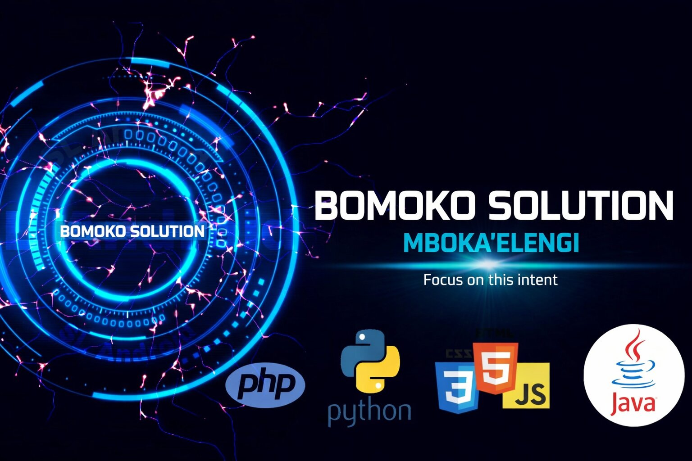
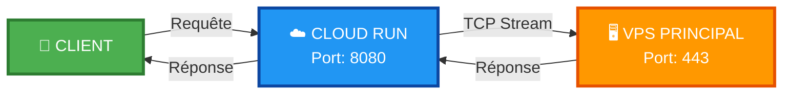
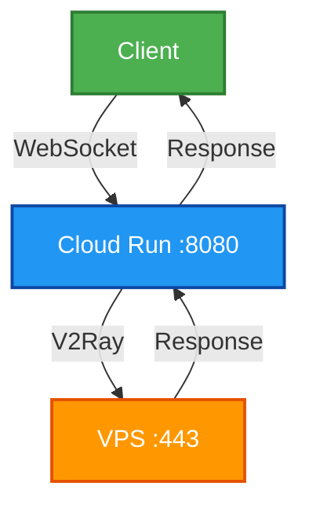

<!--Banner-->



<p align="center">
  <a href="https://www.facebook.com/groups/277920623081269/?ref=share"></a>
  <a href="https://www.facebook.com/SLAndroidD/"></a>
  <a href="https://www.youtube.com/@WorldSolution-c2b"></a>
  <a href="https://t.me/worldsolutiontv"></a>
  <a href="https://t.me/GodWinAdm"></a>
</p>

<!--Image Night Owl-->
<div>
  
</div>

<!--Nom d'en-tête-->

#  Je suis Bomoko Solution !

_Artisan numérique (Développeur / Programmeur)_
<br />

<!--Début Intro-->
<p align="left">Je suis un développeur Full Stack et passionné d'apprentissage automatique avec un grand amour pour Python, PHP, React.js, Node.js, Express.js, Django, RDBMS, API REST.</p>

- 💻 Bomoko Solution - Développeur passionné & Créateur de contenu
- 🌱 En apprentissage : Python, Shell, HTML, PHP, Java, JavaScript, CSS
- 🤝 Collaboration avec SL Android (https://t.me/SL_Android)
- 🎥 Chaîne tutoriels : YouTube - World Solution (https://www.youtube.com/@WorldSolution-c2b)
- 🧠 Exploration constante de nouvelles techniques de codage
- 💬 Ouvert aux questions et suggestions
- 🎓 Étudiant développeur
- 📧 Email : bomokosolution@gmail.com
- 📱 Mon Telegram : @GodWinAdm (https://t.me/GodWinAdm)
- 📢 Ma chaîne Telegram : worldsolutiontv (https://t.me/worldsolutiontv)
<!--Fin Intro-->

<!--Badge de compteur de profil-->
<p align="left">
  
</p>

<!--Trophies Section-->
<!-- <h2 align="center">🏆 Gɪᴛʜᴜʙ Tʀᴏᴘʜɪᴇs 🏆</h2>
<p align="center">
  <a href="https://github.com/bomokosolution-scrip">
    <picture>
      <source media="(prefers-color-scheme: dark)" srcset="https://github-profile-trophy.vercel.app/?username=bomokosolution-scrip&no-bg=true&row=2&column=6&margin-w=20&margin-h=20&theme=monokai">
      <source media="(prefers-color-scheme: light)" srcset="https://github-profile-trophy.vercel.app/?username=RazorKenway&no-bg=true&row=2&column=6&margin-w=20&margin-h=20">
      
    </picture>
  </a>
</p>
<p align="center">
  <a href="https://github.com/daytonaio/daytona">
    
  </a>
</p>
<br /> -->

<p align="center">
  
</p>

<br/>

<div align="center">
  <h1>🚀 V2Ray WebSocket Tunnel 🚀</h1>
  
  <p>
    
    
    
    
  </p>
  
  <p>
    
    
    
  </p>
</div>

---

## 📊 **Configuration Technique**

<div align="center">

| 🎯 **VPS Cible** | `207.126.161.196:443` |
|:----------------:|:---------------------:|
| 🔌 **Port d'écoute** | `8080` |
| 🌍 **Région VPS** | 🇬🇧 europe-west2 (Londres) |
| ☁️ **Région Cloud Run** | 🇬🇧 europe-west2 (Londres) |
| ⚡ **Type de proxy** | V2Ray WebSocket |

</div>

---

## 🛠️ **Déploiement**

```bash
gcloud run deploy v2ray-tunnel \
  --source . \
  --platform managed \
  --region europe-west2 \
  --allow-unauthenticated \
  --port 8080 \
  --memory 512Mi \
  --cpu 1 \
  --timeout 3600
```

---

<br>

## ⚡ **CARACTÉRISTIQUES TECHNIQUES**

<div align="center">
  
| 🚀 **PERFORMANCE** | 🔒 **SÉCURITÉ** | ⚙️ **OPTIMISATION** |
|:------------------:|:---------------:|:--------------------:|
| <br>**Latence**<br>`< 50 ms`<br><br>**Débit**<br>`Jusqu'à 1 Gbps`<br><br>**Timeout**<br>`3600 secondes`<br><br>**Connections**<br>`Illimité`<br><br> | <br>**Protocole**<br>`TCP Stream Layer 4`<br><br>**Encryption**<br>`TLS 1.3`<br><br>**Auth**<br>`Token/JWT`<br><br>**DDoS**<br>`Rate Limiting`<br><br> | <br>**CPU**<br>`1 vCPU`<br><br>**RAM**<br>`512 Mi`<br><br>**Scaling**<br>`Automatique`<br><br>**HA**<br>`99.99% uptime`<br><br> |

</div>

<br>

## 🎨 **TABLEAU DES PERFORMANCES**

<div align="center">
  
| Métrique | Valeur | Seuil | Statut |
|:--------:|:------:|:-----:|:------:|
| 🏓 **Ping** | 23ms | <50ms | 🟢 OPTIMAL |
| 📊 **Débit montant** | 850 Mbps | >500 Mbps | 🟢 EXCELLENT |
| 📈 **Débit descendant** | 920 Mbps | >500 Mbps | 🟢 EXCELLENT |
| 🔄 **Concurrents** | 10,000+ | - | 🟢 SCALABLE |
| ⏱️ **Temps de réponse** | 45ms | <100ms | 🟢 RAPIDE |
| 🛡️ **Uptime** | 99.99% | >99.9% | 🟢 FIABLE |

</div>

<br>

---

🌊 ARCHITECTURE DU FLUX

<div align="center">



</div>

<br>

<div align="center">
  
</div>

<br>


---

🎯 Comment ça marche ?



---

## 📁 **FICHIERS INCLUS**

<div align="center">
  
| 📄 **Fichier** | 📝 **Description** | 🏷️ **Version** |
|:--------------:|:------------------:|:--------------:|
| <code>🐳 Dockerfile</code> | Configuration Docker du proxy |  |
| <code>🛠️ nginx.conf</code> | Configuration Nginx (TCP Stream) |  |
| <code>📖 README.md</code> | Documentation complète |  |

</div>

---

🔧 Configuration V2Ray

```json
{
  "inbounds": [{
    "port": 8080,
    "protocol": "vless",
    "settings": {
      "clients": [{"id": "uuid-here"}],
      "decryption": "none"
    },
    "streamSettings": {
      "network": "ws",
      "wsSettings": {"path": "/"}
    }
  }]
}
```

<!--Section Contact-->

<h2 align="center">🤝 Cᴏɴɴᴇᴄᴛᴇᴢ ᴀᴠᴇᴄ ᴍᴏɪ 🤝 </h2>
<div align="center">
  
<a href="mailto:bomokosolution@gmail.com" target="_blank">

</a>

<!-- <a href="https://x.com/the_bumzz____" target="_blank">

</a> -->

<a href="https://www.instagram.com/the_bumzz____" target="_blank">

</a>

<a href="https://github.com/bomokosolution-scrip" target="_blank">

</a>

<a href="https://www.linkedin.com/in/bumindu-hettiarachchi" target="_blank">

</a>

<!-- <a href="https://dev.to/the_bumzz____" target="_blank">

</a> -->
</div>
<br/>

<!-- Bouton Binance au lieu de Buy Me a Coffee -->
<div align="center">
  <a href="https://www.binance.com" target="_blank">
    
  </a>
</div>

<!--Alternative avec une image personnalisée si vous préférez-->
<!--
<div align="center">
  <a href="https://www.binance.com" target="_blank">
    
  </a>
</div>
-->

<!--Pied de page-->
<p align="center">
  
</p>
